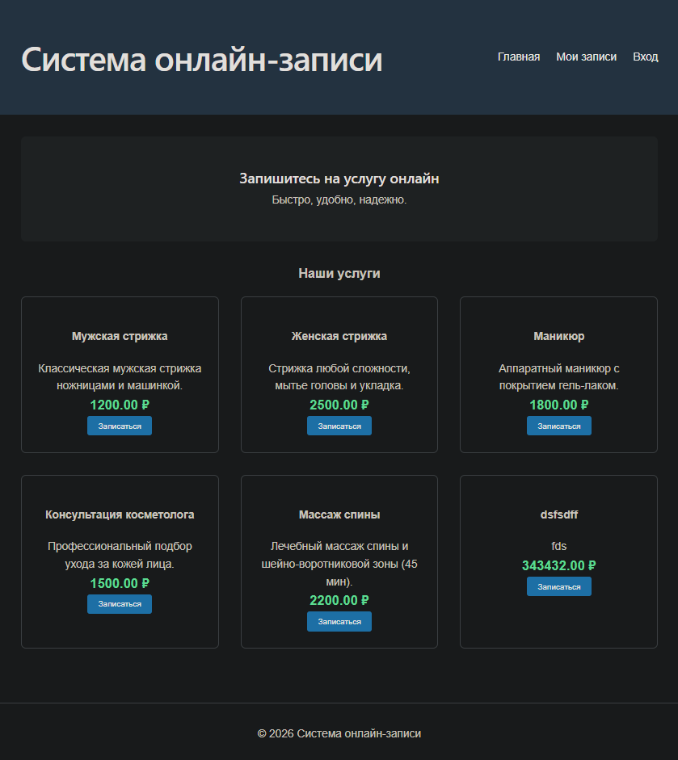

# Система онлайн-записи

Разработка веб-сервиса для записи на услуги.

## Технологический стек
- **Frontend:** React (Vite, TypeScript), CSS
- **Backend:** Node.js (Express, TypeScript)
- **База данных:** MySQL (MariaDB)
- **Тестирование:** Ручное тестирование (чек-листы)

## Команда
- Табаков Олег (Frontend, Backend, Тестирование)
- Полковников Александр (Тестирование, Документация)
- Ципий Семён (Дизайн, Проектирование прототипа)

## Схема базы данных
Минимум 3 таблицы:
1. `users`: `id`, `username`, `password_hash`, `role` (user/admin)
2. `services`: `id`, `name`, `description`, `price`
3. `bookings`: `id`, `user_id`, `service_id`, `booking_date`, `status`

Связи:
- `users.id` -> `bookings.user_id` (1:N)
- `services.id` -> `bookings.service_id` (1:N)

## Список API эндпоинтов (План)
| Метод  | Путь | Описание | Принимает | Возвращает |
|--------|------|----------|-----------|------------|
| GET    | `/api/services` | Список услуг | - | Array of services |
| POST   | `/api/register` | Регистрация | `{username, password}` | User object / Token |
| POST   | `/api/login`    | Вход | `{username, password}` | Token |
| POST   | `/api/logout`   | Выход | - | Success message |
| POST   | `/api/bookings` | Создание записи | `{service_id, date}` | Booking object |
| GET    | `/api/my-bookings` | Мои записи | - | Array of bookings |
| DELETE | `/api/bookings/:id` | Отмена записи | - | Success message |
| POST   | `/api/admin/services` | Добавление услуги | `{name, description, price}` | Service object |
| DELETE | `/api/admin/services/:id` | Удаление услуги | - | Success message |
| GET    | `/api/admin/all-bookings` | Все записи | - | Array of all bookings |

## Инструкция по запуску
1. Настроить MySQL базу данных. (`docker compose up -d`)
2. `cd backend && npm install && npm run dev`
3. `cd frontend && npm install && npm run dev`

## Скриншоты
Главная страница:
